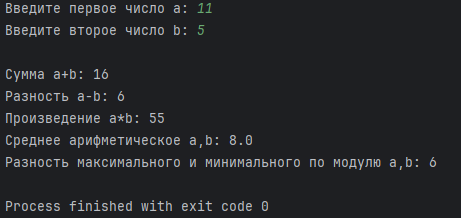
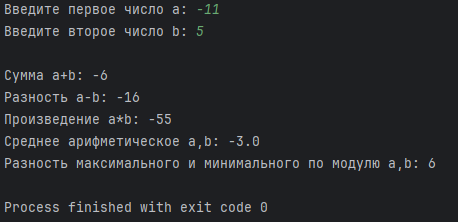
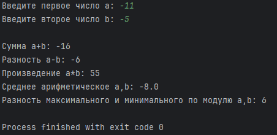

# Исполнитель

Слобожанинов Владислав

Группа Фт-230008

# Задание №1

## Формулировка задания №1

Написать на любом языке программу со следующим функционалом: Пользователь должен ввести 2 числа. Определить и вывести на экран: cумму чисел, разность чисел, произведение чисел, среднее арифметическое значение чисел, разность максимального и минимального по модулю.
Замечание: при решении не использовать библиотечные функции модуля, максимума и минимума.

## Среда разработки

Язык программирования Python.

Среда разработки: PyCharm.

## Инструкция по работе

По запросу программы ввести число a и затем число b.

## Тестирование задания №1

Тест 1

Тест 2

Тест 3

